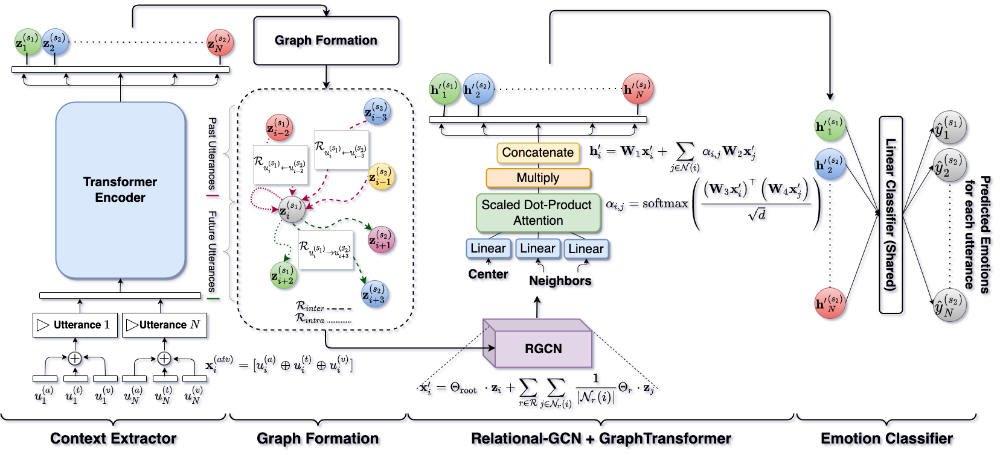

## COGMEN; Official Pytorch Implementation

**CO**ntextualized **G**NN based **M**ultimodal **E**motion recognitio**N**

**Picture:** *COGMEN Model Architecture*

This repository contains the official Pytorch implementation of the following paper:
> **COGMEN: COntextualized GNN based Multimodal Emotion recognitioN** 

> Anonymous ACL submission 
>
> **Abstract:** *Emotions are an inherent part of human interactions, and consequently, it is imperative to develop AI systems that understand and recognize human emotions. During a conversation involving various people, a person’s emotions are influenced by the other speaker’s utterances and their own emotional state over the utterances. In this paper, we propose COntextualized Graph Neural Network based Multimodal Emotion recognitioN (COGMEN) system that leverages local information (i.e., inter/intra dependency between speakers) and global information (context). The proposed model uses Graph Neural Network (GNN) based architecture to model the complex dependencies (local and global information) in a conversation. Our model gives state-of-theart (SOTA) results on IEMOCAP and MOSEI datasets, and detailed ablation experiments
show the importance of modeling information at both levels*

## Requirements

- We use PyG (PyTorch Geometric) for the GNN component in our architecture. [RGCNConv](https://pytorch-geometric.readthedocs.io/en/latest/modules/nn.html#torch_geometric.nn.conv.RGCNConv) and [TransformerConv](https://pytorch-geometric.readthedocs.io/en/latest/modules/nn.html#torch_geometric.nn.conv.TransformerConv)

- We use [comet](https://comet.ml) for logging all our experiments and its Bayesian optimizer for hyperparameter tuning. 

- For textual features we use [SBERT](https://www.sbert.net/).
### Installations
- [Install PyTorch Geometric](https://pytorch-geometric.readthedocs.io/en/latest/notes/installation.html)

- [Install Comet.ml](https://www.comet.ml/docs/python-sdk/advanced/)
- [Install SBERT](https://www.sbert.net/)

## Preparing datasets for training

        python preprocess.py --dataset="iemocap_4"

## Training networks 

        python train.py --dataset="iemocap_4" --modalities="atv" --from_begin --epochs=55

## Run Evaluation 

        python eval.py --dataset="iemocap_4" --modalities="atv"

## Results

Table below shows **COGMEN** results on the IEMOCAP dataset for all the modality combinations. 

| Modalities    | IEMOCAP-4way (F1 Score (\%))      | IEMOCAP-6way (F1 Score (\%))   
| :-----       | :---              | :-----   
| a            | 63.58             |  47.57                  
| t            | 81.55             |  66.00                   
| v            | 43.85             |  37.58                  
| at           | 81.59             |  65.42                   
| av           | 64.48             |  52.20                  
| tv           | 81.52             |  62.19                  
**atv** | **84.50**    |  **67.63**           

## Conclusion

> We present a novel approach of using GNNs
for multimodal emotion recognition and propose
**COGMEN: COntextualized GNN based Multimodal Emotion recognitioN**. We test **COGMEN**
on two widely known multimodal emotion recognition datasets, IEMOCAP and MOSEI. **COGMEN**
outperforms the existing state-of-the-art methods
in multimodal emotion recognition by a significant
margin (i.e., 7.7% F1-score increase for IEMOCAP (4-way)). By comprehensive analysis and
ablation studies over **COGMEN**, we show the importance of different modules. **COGMEN** fuses
information effectively from multiple modalities
to improve the performance of emotion prediction
tasks. We perform a detailed error analysis and
observe that the misclassifications are mainly between the similar classes and emotion shift cases.
We plan to address this in future work, where the
focus will be to incorporate a component for capturing the emotional shifts for fine-grained emotion
prediction. 

## Acknowledgments
The structure of our code is inspired by [pytorch-DialogueGCN-mianzhang](https://github.com/mianzhang/dialogue_gcn).
